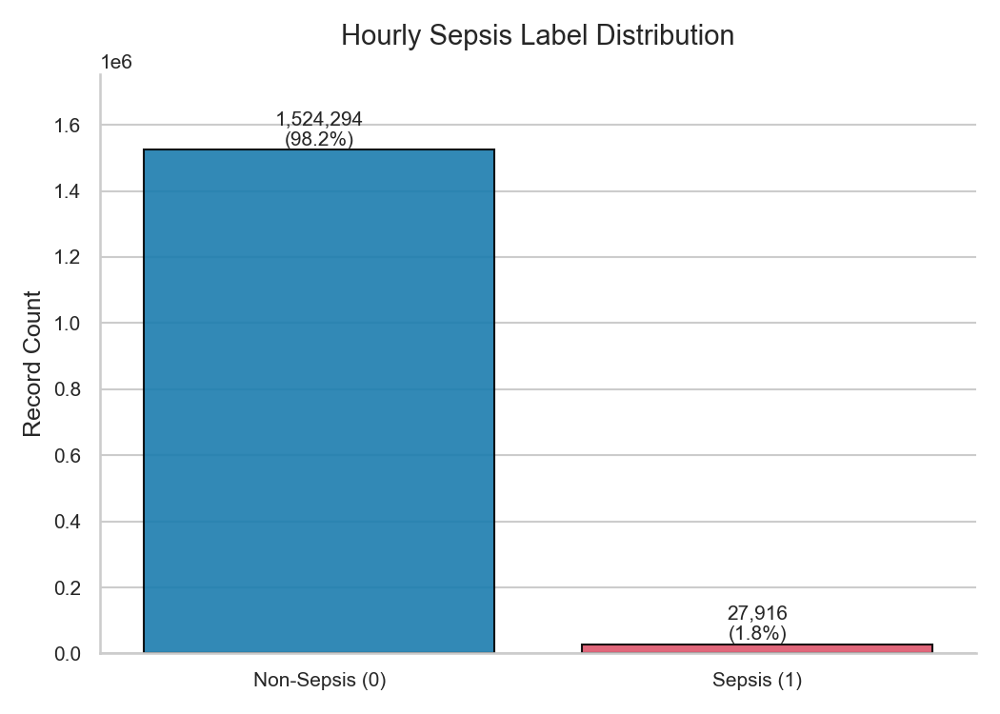
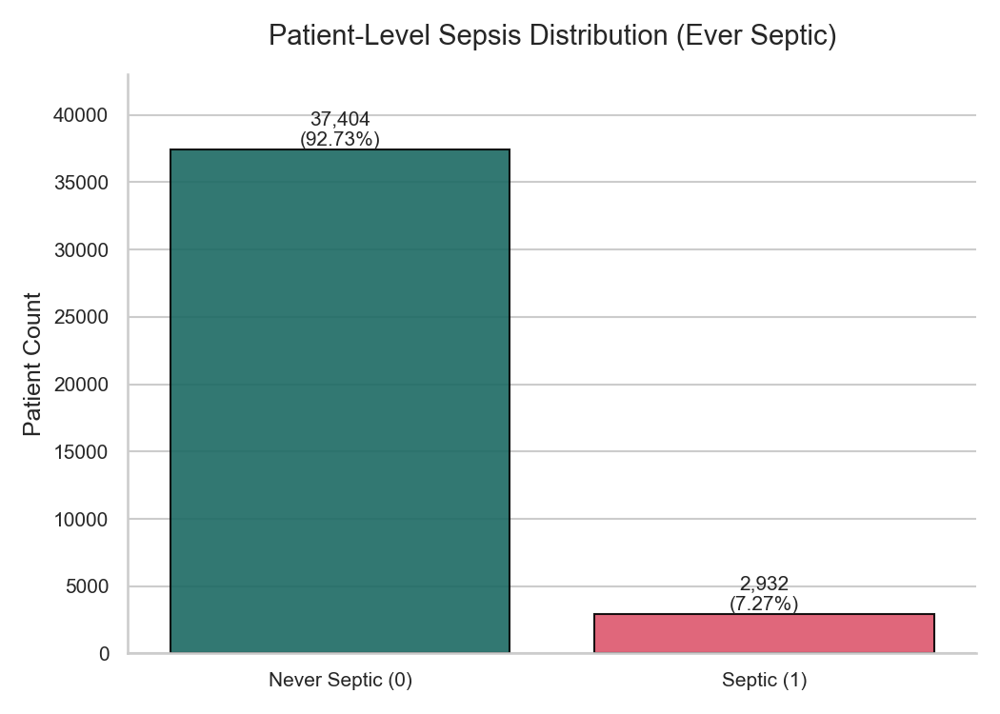
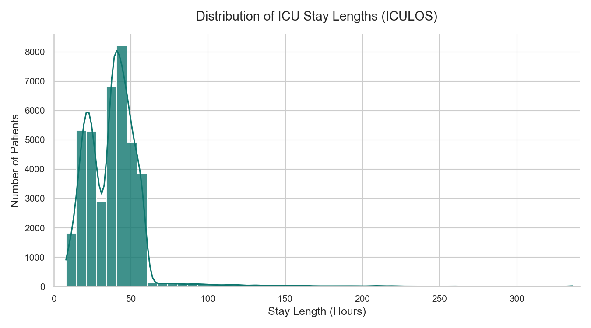
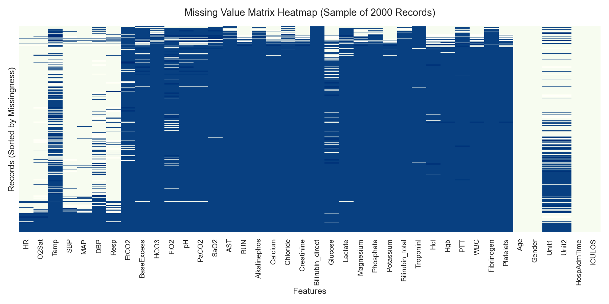
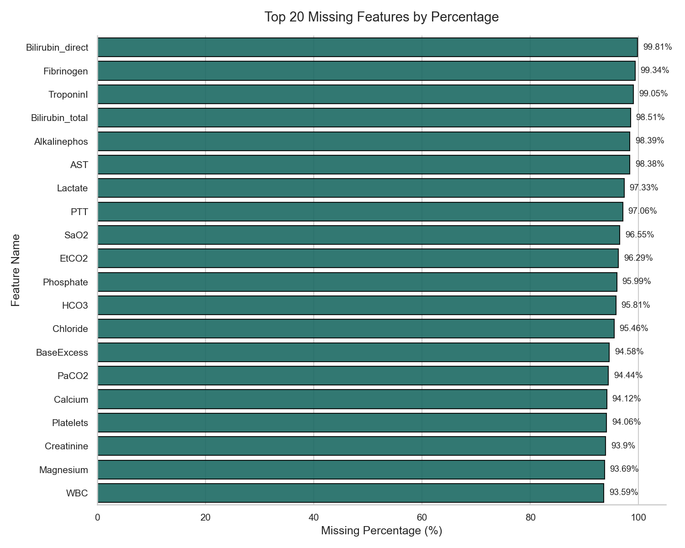
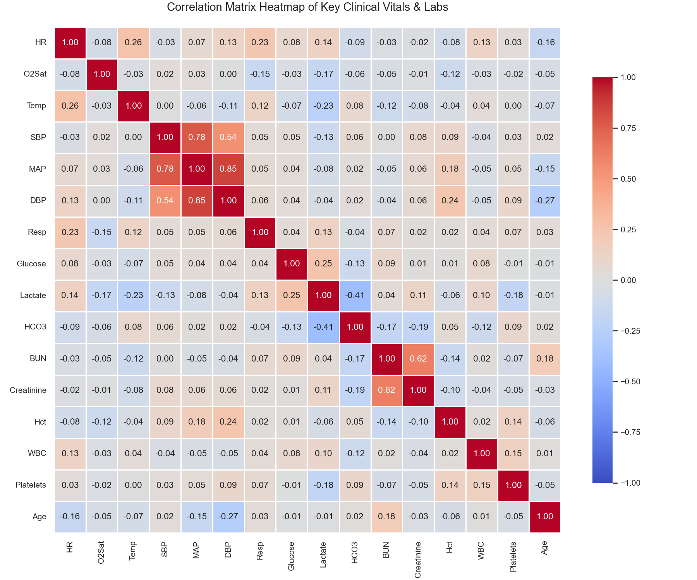
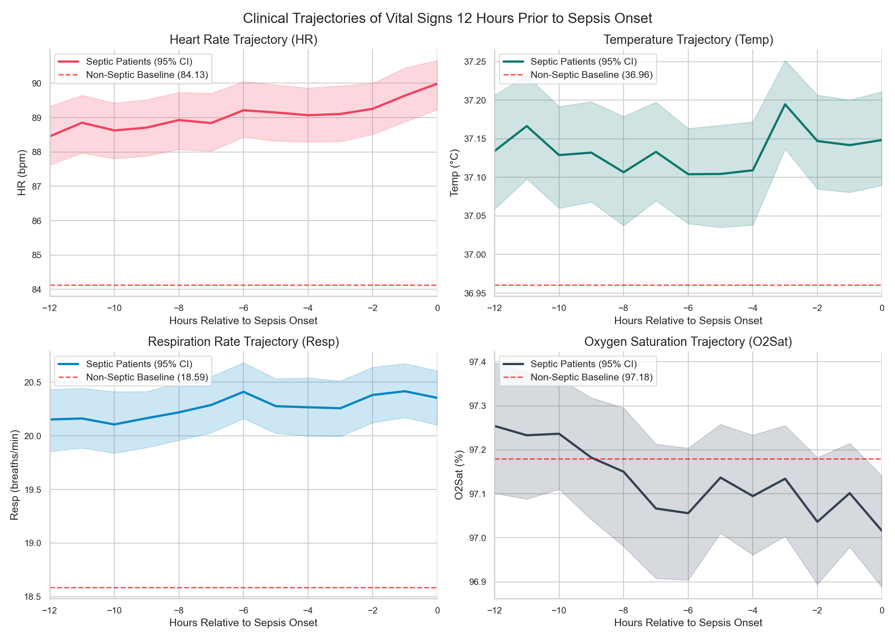

# THAARU Sepsis AI — Clinical Intelligence
## Exploratory Data Analysis (EDA) Research Report
**Generated:** July 19, 2026

---

## 1. Executive Summary & Dataset Overview
This report documents the dataset statistics and patient clinical features for the consolidated PhysioNet Challenge 2019 dataset.

### Key Cohort Specifications
* **Dataset Source:** PhysioNet Challenge 2019
* **Unique Patients Cohort:** 40,336
* **Total Hourly Records:** 1,552,210
* **Features (Vitals & Labs):** 40
* **Stay Length (Mean / Median):** 39.01h / 39.0h
* **Stay Length (Min / Max Range):** 8h - 336h
* **Derived CSV Size:** 141.5 MB
* **Derived Parquet Size:** 15.7 MB (9x compressed)

---

## 2. Cohort Sepsis & Class Distribution
Due to the acute nature of Sepsis in the ICU, the dataset exhibits extreme class imbalance at the hourly level. However, a significant fraction of the patients eventually contract sepsis.

* **Hourly Records:**
  * Sepsis (Label 1): **27,893 records (1.80%)**
  * Non-Sepsis (Label 0): **1,524,317 records (98.20%)**
* **Patient Level Cohorts:**
  * Septic Patients (Contracted Sepsis during ICU stay): **2,932 patients (7.27%)**
  * Non-Septic Patients (Never contracted Sepsis): **37,404 patients (92.73%)**

### Class Distribution Visualizations

---

## 3. Patient ICU Stay Lengths
The duration of ICU stay varies from 8 hours to over 300 hours. The histogram below outlines the right-skewed distribution of stay durations:

---

## 4. Missing Data & Heatmap
Laboratory results are sparse since clinicians order tests only when clinically indicated. The vital signs are measured much more regularly.

---

## 5. Feature Correlations
Highly correlated clinical parameter clusters include Systolic/Mean/Diastolic blood pressures (SBP, MAP, DBP) and hematology measures (Hgb, Hct).

---

## 6. Physiological Trajectories Leading to Sepsis (12 Hours Prior)
Aligning septic patient timelines by their diagnostic hour reveals a transition trajectory: Heart Rate and Respiration increase steadily, while Oxygen Saturation declines prior to onset, demonstrating the clinical value of time-series LSTM modeling.

---

## 7. Pipeline Preprocessing Conclusions
1. **Imputation:** Carry-forward (forward-fill) should be used for missing vital values up to a 6-hour threshold. Global mean imputation must be avoided to prevent variance dilution.
2. **Robust Scaling:** Outliers in blood pressure and heart rate require robust normalization strategies.
3. **Class Weighted Loss:** Models must incorporate Focal Loss or class weighting to counter the 98.20% class imbalance at the hourly sequence level.