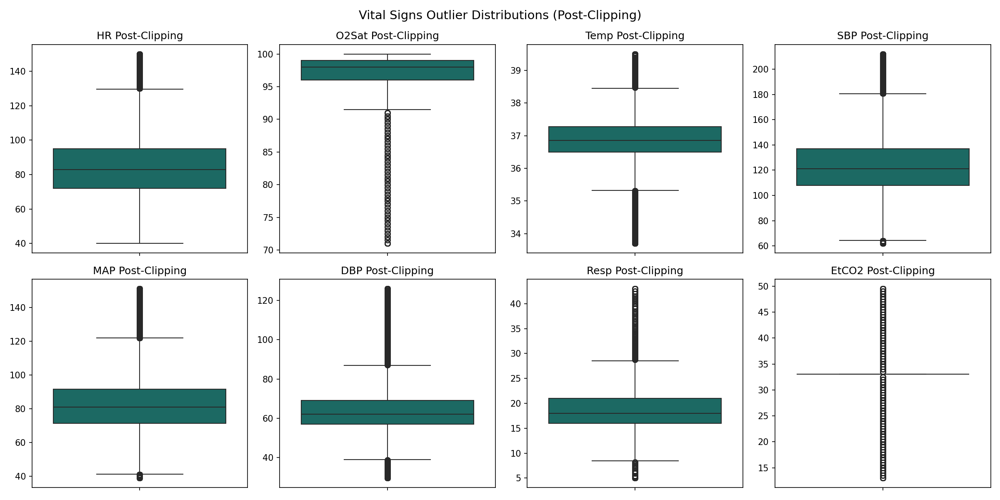

# THAARU Sepsis AI — Preprocessing Report
## Preprocessing Pipeline Research Summary
**Generated:** July 19, 2026

---

## 1. Executive Summary & Pipeline Setup
This report summarizes the data cleaning, range validation, adaptive time-series imputation, and scaling parameters executed on the Sepsis Challenge dataset. 

* **Train Set Patients:** 28,235 patients (1,086,436 records)
* **Validation Set Patients:** 6,050 patients (231,472 records)
* **Test Set Patients:** 6,051 patients (234,302 records)
* **Total Schema Features:** 68 (Vitals, Labs, demographics, plus 26 missingness flags)

---

## 2. Preprocessing Strategy & Leakage Prevention
To ensure correct generalization, scaling and imputation medians are computed exclusively on the **Train Split** and applied symmetrically to Val/Test:
* **Vitals Imputation:** Patient-wise forward-fill (limit=6h) + Train Medians
* **Labs Imputation:** Patient-wise forward-fill (unlimited) + Train Medians
* **Outlier Handling:** Winsorizing/Clipping at 0.1% - 99.9% percentiles fit on Train set to remove extreme noise
* **Feature Scaling:** StandardScaler fit on Train set and applied to all splits

---

## 3. Clinical Range Validation Replacements
Out-of-bound vital sign measurements were replaced with NaN. Below is the count of invalid replacements:

| Feature | Range Limit | Train Replaces | Val Replaces | Test Replaces |
| :--- | :--- | :--- | :--- | :--- |
| HR | 20 - 250 | 0 | 4 | 0 |
| Temp | 25 - 45 | 5 | 0 | 1 |
| Resp | 4 - 80 | 1,333 | 288 | 216 |
| SBP | 40 - 300 | 63 | 27 | 24 |
| MAP | 20 - 200 | 286 | 85 | 73 |
| DBP | 20 - 200 | 55 | 20 | 28 |
| pH | 6.8 - 8.0 | 8 | 1 | 2 |

---

## 4. Post-Clipping Vital Distributions
Conservative percentile clipping preserves plausible clinical shock values while capping sensor entry error spikes.

---

## 5. Quality Assurance Checklist
A complete validation suite was run on the output files:
* **Null Values Remaining:** Train: 0, Val: 0, Test: 0
* **Duplicate Records:** Train: 0, Val: 0, Test: 0
* **Patient Overlap Overflows (Leakage):** Train/Val: 0, Train/Test: 0, Val/Test: 0 (Mutual overlap must be 0)
* **Schema Symmetrics:** Columns match exactly across splits (Train features: 68, Val: 68)

---

## 6. Preprocessing Conclusion
The preprocessing foundation is stable, leak-proof, and fully reproducible. Processed datasets are stored in Parquet format and ready for sequence formatting and LSTM training.